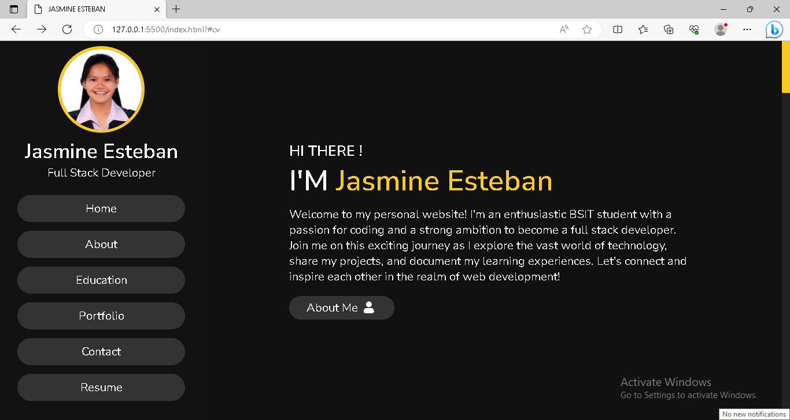

# DEVELOPER PORTFOLIO

A personal website portfolio

## Author

[@jsmn_stbn](https://www.twitter.com/jsmn_stbn)

## Github repository

This is the [link](https://jasmineesteban.github.io/Portfolio/) to the Github repository of the project.

## Tech Stack

**Client:** HTML, CSS, Vanilla JavaSCript

## Tools Used

Below are are list of tools used, and the precise things they were used for:

- [Font Awesome](https://fontawesome.com/v4/icon/list) for animated icons and skills icons
- [Freepik](https://www.freepik.com/) for project images.
